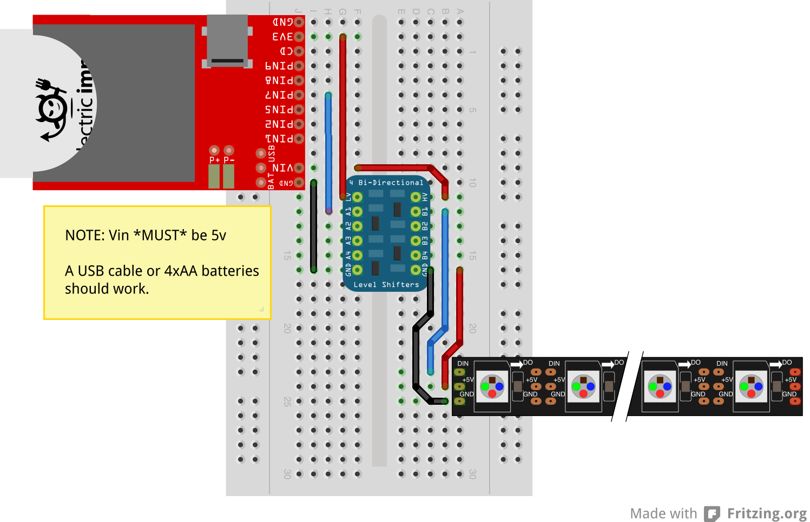

# WS2812_IMP3

This class allows the imp to drive WS2812 and WS2812B LEDs. The WS2812 is an all-in-one RGB LED with integrated shift register and constant-current driver. The parts are daisy-chained, and a proprietary one-wire protocol is used to send data to the chain of LEDs. Each pixel is individually addressable and this allows the part to be used for a wide range of effects animations.

Some example hardware that uses the WS2812 or WS2812B:

* [40 NeoPixel Matrix](http://www.adafruit.com/products/1430)
* [60 LED - 1m strip](http://www.adafruit.com/products/1138)
* [30 LED - 1m strip](http://www.adafruit.com/products/1376)
* [NeoPixel Stick](http://www.adafruit.com/products/1426)

**Please copy and paste the `WS2812_IMP3.class.nut` file at the top of your device code **

**Updated Library Release:** WS2812 v3.0.0 now supports imp003 and imp004m.  Please use [WS2812 Library](https://github.com/electricimp/WS2812).

## Hardware

WS2812s require a 5V power supply and logic, and each pixel can draw up to 60mA when displaying white in full brightness, so be sure to size your power supply appropriatly. Undersized power supplies (lower voltages and/or insufficent current) can cause glitches and/or failure to produce and light at all.

Because WS2812s require 5V logic, you will need to shift your logic level to 5V. A sample circuit can be found below using Adafruit’s [4-channel Bi-directional Logic Level Converter](http://www.adafruit.com/products/757):



## Class Usage

All public methods in the WS2812 class return `this`, allowing you to easily chain multiple commands together:

```squirrel
pixels
    .set(0, [255,0,0])
    .set(1, [0,255,0])
    .fill([0,0,255], 2, 4)
    .draw();
```

### Constructor: WS2812_IMP3(spi, frameSize, [draw])

Instantiate the class with a pre-configured SPI object and the number of pixels that are connected. The SPI object must be configured at 90000kHz and have the *MSB_FIRST* flag set:

```squirrel
// Configure the SPI bus
spi <- hardware.spiLGDK
spi.configure(MSB_FIRST, 9000);

// Instantiate LED array with 8 pixels
pixels <- WS2812_IMP3(spi, 8);
```

An optional third parameter can be set to control whether the class will draw an empty frame on initialization. The default value is `true`.

## Class Methods

### configure()

Rather than pass a preconfigured SPI object to the constructor, you can pass an unconfigured SPI object, and have the *configure()* method automatically configure the SPI object for you.

**NOTE:** If you are using the *configure* method, you **must** pass `false` the the *draw* parameter of the constructor:

```squirrel
// Create and configure an LED array with 8 pixels:
pixels <- WS2812(hardware.spiLGDK, 8, false).configure();
```

### set(*index, color*)

The *set* method changes the color of a particular pixel in the frame buffer. The color is passed as as an array of three integers between 0 and 255 representing `[red, green, blue]`.

NOTE: The *set* method does not output the changes to the pixel strip. After setting up the frame, you must call `draw` (see below) to output the frame to the strip.

```squirrel
// Set and draw a pixel
pixels.set(0, [127,0,0]).draw();
```

### fill(*color, [start], [end]*)

The *fill* methods sets all pixels in the specified range to the desired color. If no range is selected, the entire frame will be filled with the specified color.

NOTE: The *fill* method does not output the changes to the pixel strip. After setting up the frame, you must call `draw` (see below) to output the frame to the strip.

```squirrel
// Turn all LEDs off
pixels.fill([0,0,0]).draw();
```

```squirrel
// Set half the array red
// and the other half blue
pixels
    .fill([100,0,0], 0, 2)
    .fill([0,0,100], 3, 4);
    .draw();
```

### draw()

The *draw* method draws writes the current frame to the pixel array (see examples above).

## License

The WS2812 class is licensed under the [MIT License](/LICENSE).
